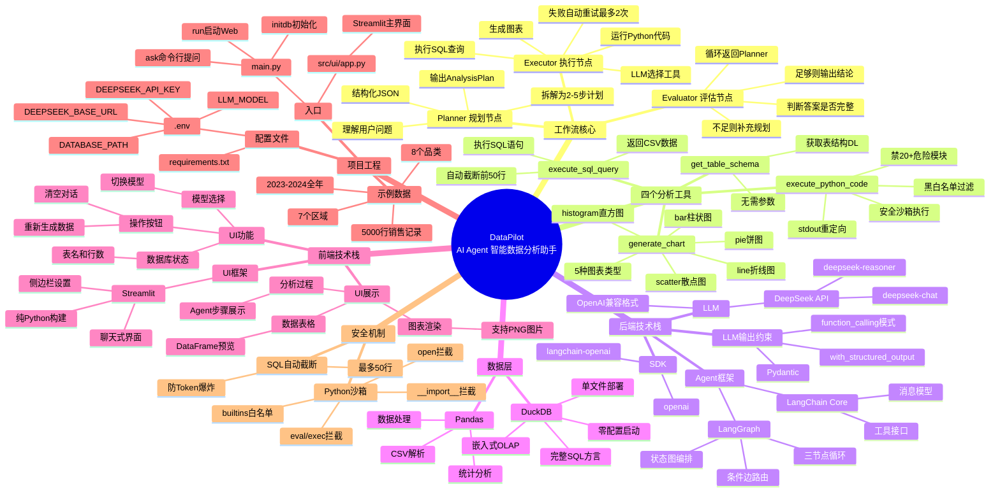

# DataPilot 思维导图

```mermaid
mindmap
  root((DataPilot<br/>AI Agent 智能数据分析助手))
    工作流核心
      Planner 规划节点
        理解用户问题
        拆解为2-5步计划
        输出AnalysisPlan
        结构化JSON
      Executor 执行节点
        LLM选择工具
        执行SQL查询
        运行Python代码
        生成图表
        失败自动重试最多2次
      Evaluator 评估节点
        判断答案是否完整
        足够则输出结论
        不足则补充规划
        循环返回Planner
    四个分析工具
      get_table_schema
        获取表结构DL
        无需参数
      execute_sql_query
        执行SQL语句
        返回CSV数据
        自动截断前50行
      execute_python_code
        安全沙箱执行
        黑白名单过滤
        禁20+危险模块
        stdout重定向
      generate_chart
        5种图表类型
        bar柱状图
        line折线图
        scatter散点图
        pie饼图
        histogram直方图
    后端技术栈
      LLM
        DeepSeek API
          deepseek-chat
          deepseek-reasoner
        OpenAI兼容格式
      Agent框架
        LangGraph
          状态图编排
          三节点循环
          条件边路由
        LangChain Core
          消息模型
          工具接口
      SDK
        langchain-openai
        openai
      LLM输出约束
        Pydantic
        with_structured_output
        function_calling模式
    数据层
      DuckDB
        嵌入式OLAP
        单文件部署
        完整SQL方言
        零配置启动
      Pandas
        数据处理
        CSV解析
        统计分析
    前端技术栈
      UI框架
        Streamlit
          纯Python构建
          聊天式界面
          侧边栏设置
      UI功能
        模型选择
          切换模型
        数据库状态
          表名和行数
        操作按钮
          重新生成数据
          清空对话
      UI展示
        图表渲染
          支持PNG图片
        数据表格
          DataFrame预览
        分析过程
          Agent步骤展示
    项目工程
      配置文件
        .env
          DEEPSEEK_API_KEY
          DEEPSEEK_BASE_URL
          LLM_MODEL
          DATABASE_PATH
        requirements.txt
      入口
        main.py
          initdb初始化
          run启动Web
          ask命令行提问
        src/ui/app.py
          Streamlit主界面
      示例数据
        5000行销售记录
        7个区域
        8个品类
        2023-2024全年
    安全机制
      Python沙箱
        __import__拦截
        open拦截
        eval/exec拦截
        builtins白名单
      SQL自动截断
        最多50行
        防Token爆炸
```
