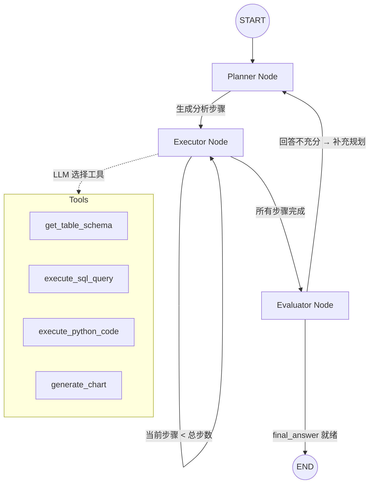

<p align="center">
  
</p>

<h1 align="center">DataPilot</h1>

<p align="center">
  <strong>AI Agent 驱动的智能数据分析助手</strong><br>
  用自然语言提问，Agent 自动规划、查询、计算、绘图并给出结论
</p>

<p align="center">
  
  
  
  
  
  
</p>

---

## 目录

- [项目简介](#项目简介)
- [技术架构](#技术架构)
- [快速开始](#快速开始)
- [使用方式](#使用方式)
- [使用示例](#使用示例)
- [项目结构](#项目结构)
- [核心设计](#核心设计)
- [未来计划](#未来计划)
- [贡献指南](#贡献指南)
- [许可证](#许可证)

---

## 项目简介

DataPilot 是一个基于 **LangGraph + DeepSeek** 的智能数据分析 Agent。用户只需用自然语言描述分析需求，Agent 就会自动完成以下全流程：

```
"华东区2023年哪个品类销售额最高？"
        │
        ▼
  ┌─────────────────────────────────────┐
  │  Planner    →  拆解为 4 步计划        │
  └──────────────┬──────────────────────┘
                 ▼
  ┌─────────────────────────────────────┐
  │  Executor   →  获取Schema → 写SQL    │
  │               执行查询 → 生成图表      │
  └──────────────┬──────────────────────┘
                 ▼
  ┌─────────────────────────────────────┐
  │  Evaluator  →  评估结果完整性         │
  │               补充或输出最终结论       │
  └─────────────────────────────────────┘
```

**核心能力：**
- 🤖 **自动规划** — AI 将模糊需求拆解为可执行的分析步骤
- 📊 **SQL 自动生成** — 理解表结构，编写并执行 DuckDB 查询
- 🐍 **Python 沙箱** — 在受限环境中执行统计计算、数据清洗
- 📈 **可视化** — 自动生成柱状图、折线图、散点图、饼图、直方图
- 🔄 **自我修正** — SQL 报错或结果不充分时，Agent 自动重试或补充分析

---

## 技术架构

### Agent 工作流 (LangGraph)



### 技术选型

| 层级 | 技术 | 选择理由 |
|------|------|----------|
| **LLM** | DeepSeek (deepseek-chat / deepseek-reasoner) | 兼容 OpenAI 格式，性价比极高，中文理解出色 |
| **Agent 框架** | LangGraph + LangChain | 状态图编排、工具调用、结构化输出 |
| **数据库** | DuckDB | 嵌入式 OLAP，零配置，支持完整 SQL，单文件部署 |
| **数据处理** | Pandas + NumPy | Python 生态标准，丰富的数据操作 API |
| **可视化** | Matplotlib | 成熟的绘图库，支持非交互式后端 (Agg) |
| **前端** | Streamlit | 纯 Python 构建聊天界面，快速迭代 |
| **配置** | Pydantic + python-dotenv | 结构化输出约束 + 环境变量管理 |

---

## 快速开始

### 环境要求

- **Python** >= 3.10
- **DeepSeek API Key** — 从 [platform.deepseek.com](https://platform.deepseek.com/api_keys) 获取

### 1. 克隆仓库

```bash
git clone https://github.com/your-username/datapilot.git
cd datapilot
```

### 2. 创建虚拟环境

```bash
python -m venv venv

# macOS / Linux
source venv/bin/activate

# Windows
venv\Scripts\activate
```

### 3. 安装依赖

```bash
pip install -r requirements.txt
```

<details>
<summary>依赖清单（点击展开）</summary>

| 包 | 版本 | 用途 |
|---|------|------|
| `langgraph` | >=0.2.0 | Agent 工作流编排 |
| `langchain-core` | >=0.3.0 | 消息模型、工具接口 |
| `langchain-openai` | >=0.2.0 | OpenAI 兼容模型集成（DeepSeek） |
| `openai` | >=1.0.0 | OpenAI SDK |
| `duckdb` | >=1.1.0 | 嵌入式 SQL 分析引擎 |
| `pandas` | >=2.2.0 | 数据处理 |
| `matplotlib` | >=3.9.0 | 图表绘制 |
| `streamlit` | >=1.38.0 | Web 前端 |
| `python-dotenv` | >=1.0.0 | 环境变量管理 |
| `pydantic` | >=2.0.0 | 结构化输出校验 |

</details>

### 4. 配置环境变量

```bash
cp .env.example .env
```

编辑 `.env` 文件，填入你的 API Key：

```ini
DEEPSEEK_API_KEY=sk-your-key-here
DEEPSEEK_BASE_URL=https://api.deepseek.com/v1
LLM_MODEL=deepseek-chat
DATABASE_PATH=./data/sample.db
```

### 5. 初始化数据库

```bash
python main.py initdb
```

该命令会自动创建 DuckDB 数据库并填充 5000 行模拟销售数据（7 个区域 × 8 个品类 × 2023-2024 全年）。

### 6. 启动应用

```bash
# 方式一：直接使用 CLI
python main.py run

# 方式二：使用 Streamlit
streamlit run src/ui/app.py

# 指定端口
python main.py run --port 8502
```

浏览器访问 `http://localhost:8501` 即可使用。

### 7. 命令行直接提问（可选）

```bash
python main.py ask "华东区2023年Q1和Q2的销售额对比，哪个品类增长最快？"
```

---

## 使用方式

### Web 界面

启动后在聊天输入框中用自然语言提问。侧边栏提供：

- **模型选择** — 在 deepseek-chat / deepseek-reasoner 之间切换
- **数据库状态** — 实时显示数据表名和行数
- **操作按钮** — 重新生成示例数据 / 清空对话

### CLI 命令

```bash
# 查看帮助
python main.py --help

# 子命令
python main.py initdb              # 初始化数据库
python main.py run                  # 启动 Streamlit
python main.py run --port 8502      # 指定端口
python main.py ask "你的问题"        # 命令行分析
python main.py ask --model deepseek-chat "复杂分析问题"
```

---

## 使用示例

### 示例对话：区域销售分析

**用户提问：**

> 华东区2023年哪个品类销售额最高？各季度趋势如何？

**Agent 自动执行：**

```
📋 分析计划 (初始)
> 先了解数据结构，再按季度和品类聚合销售数据，最后生成趋势图对比。

1. 使用 get_table_schema 获取 sales 表的字段信息
2. 使用 execute_sql_query 查询华东区2023年按季度和品类的销售额
3. 使用 execute_python_code 计算各品类的同比增长率
4. 使用 generate_chart 生成各品类季度趋势的折线图
```

```
🗄️ 第一步 — 获取表结构
→ CREATE TABLE sales (sale_id INTEGER, region VARCHAR, category VARCHAR, ...)
```

```
📊 第二步 — SQL 查询
→ SELECT category,
         EXTRACT(quarter FROM sale_date) AS qtr,
         SUM(amount) AS total
  FROM sales
  WHERE region = '华东' AND YEAR(sale_date) = 2023
  GROUP BY category, qtr
  ORDER BY category, qtr

返回 32 行数据（8 品类 × 4 季度）
```

```
📈 第四步 — 生成图表
→ generate_chart(chart_type="line", x="qtr", y="total", title="华东区2023各品类季度趋势")
```

**Agent 最终回答：**

> **华东区2023年销售分析结论**
>
> 1. **电子产品** 以 ¥15,280 的销售额位居第一，占华东区总销售额的 24.3%
> 2. **家居用品** 紧随其后，销售额 ¥12,450（19.8%）
> 3. 从季度趋势来看，Q4 所有品类均有明显增长（平均环比 +18%），推测与年末促销有关
> 4. **运动户外** 在 Q2-Q3 期间增长最快（+35%），与季节性需求吻合
>
> 

---

## 项目结构

```
datapilot/
├── main.py                       # CLI 入口 (argparse 子命令)
├── requirements.txt              # Python 依赖
├── .env.example                  # 环境变量模板
├── README.md                     # 项目文档
│
├── src/
│   ├── __init__.py               # 统一初始化入口 (initialize / get_db_manager)
│   │
│   ├── agent/
│   │   ├── __init__.py
│   │   ├── graph.py              # LangGraph 工作流 (Planner → Executor → Evaluator)
│   │   └── tools.py              # 4 个 @tool 工具函数 (Schema / SQL / Python / Chart)
│   │
│   ├── data/
│   │   ├── __init__.py
│   │   ├── db.py                 # DuckDBManager 类 (连接管理 / Schema查询 / SQL执行)
│   │   └── sample_data.py        # 示例数据生成器 (5000行 × 7区域 × 8品类)
│   │
│   └── ui/
│       ├── __init__.py
│       └── app.py                # Streamlit 聊天界面 (侧边栏 + 对话区 + 图表展示)
│
├── data/
│   └── sample.db                 # 示例数据库 (首次运行自动生成，已 gitignore)
│
└── tests/
    ├── __init__.py
    └── test_tools.py             # 工具函数单元测试
```

---

## 核心设计

### 1. Agent 三节点循环

```
START → Planner → Executor ⇄ Executor (逐步执行)
                      ↓
                  Evaluator → END 或 → Planner (补充规划)
```

- **Planner** — 使用 `with_structured_output(AnalysisPlan, method="function_calling")` 将模糊问题拆解为 2-5 个原子步骤
- **Executor** — 使用 `bind_tools(ALL_TOOLS)` 让 LLM 选择合适的工具执行每一步；失败时自动将错误反馈给 LLM 重试（最多 2 次）
- **Evaluator** — 使用 `with_structured_output(EvaluationResult, method="function_calling")` 判断是否已完整回答；若不足则生成 `additional_steps` 触发重新规划

### 2. 四个原子工具

| 工具 | 输入 | 输出 | 用途 |
|------|------|------|------|
| `get_table_schema` | 无 | DDL 字符串 | 让 Agent 理解数据结构 |
| `execute_sql_query` | SQL 语句 | CSV (前50行) | 数据查询，自动截断防 token 爆炸 |
| `execute_python_code` | Python 代码 + 可选 CSV | stdout 输出 | 统计分析、数据清洗（受限沙箱） |
| `generate_chart` | CSV + 图表类型 + x/y 列名 | PNG 文件路径 | 5 种图表（bar/line/scatter/pie/histogram） |

工具间通过 CSV 字符串管道串联：**SQL 查询 → CSV → Python 分析 / 图表生成**

### 3. 安全沙箱

`execute_python_code` 在受限环境中执行：
- **黑名单拦截** — 禁止导入 `os`/`sys`/`subprocess` 等 20+ 危险模块
- **调用检测** — 拦截 `open()`/`eval()`/`exec()`/`compile()` 等危险函数
- **受限 builtins** — 仅暴露约 40 个安全的 Python 内置函数
- **stdout 隔离** — 通过 `sys.stdout` 重定向捕获所有输出

> 当前为基础保护，生产环境建议配合 Docker 容器或 gVisor 实现强隔离。

### 4. 统一初始化链路

```
main.py / app.py
       │
       ▼
src.initialize(db_path?)
  ├── load_dotenv()
  ├── DuckDBManager.connect()
  ├── generate_sample_data()   ← 幂等：数据存在则跳过
  ├── tools.set_db_manager()   ← 依赖注入
  └── return DuckDBManager
```

所有入口共享同一初始化逻辑，避免重复代码。

---

## 未来计划

- [ ] **多数据源支持** — 连接 MySQL / PostgreSQL / CSV / Parquet 文件
- [ ] **对话记忆** — 多轮对话上下文保持，支持追问和细化
- [ ] **流式输出** — 实时展示 Agent 思考过程和 SQL 执行结果
- [ ] **更多图表类型** — 热力图、箱线图、地图可视化
- [ ] **数据分析模板** — 预置 RFM 分析、留存分析、漏斗分析等常见场景
- [ ] **结果导出** — 一键导出分析报告为 PDF / Excel
- [ ] **Docker 部署** — 提供一键部署的 Docker Compose 配置
- [ ] **Python 沙箱强化** — 使用 Docker SDK 或 gVisor 实现真正隔离

---

## 贡献指南

欢迎贡献！请遵循以下流程：

1. **Fork** 本仓库
2. 创建特性分支：`git checkout -b feat/your-feature`
3. 编写代码并添加测试
4. 确保现有测试通过：`python -m pytest tests/`
5. 提交 Pull Request，描述改动内容和动机

### 本地开发

```bash
pip install -r requirements.txt
pip install pytest black ruff  # 开发工具

# 代码格式化
black src/ tests/
ruff check src/ tests/

# 运行测试
python -m pytest tests/ -v
```

---

## 许可证

本项目基于 [MIT License](LICENSE) 开源。

---

<p align="center">
  <sub>Built with ❤️ using LangGraph + DeepSeek + DuckDB + Streamlit</sub>
</p>
